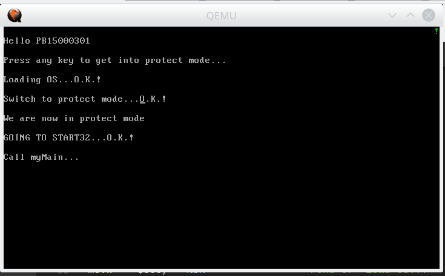
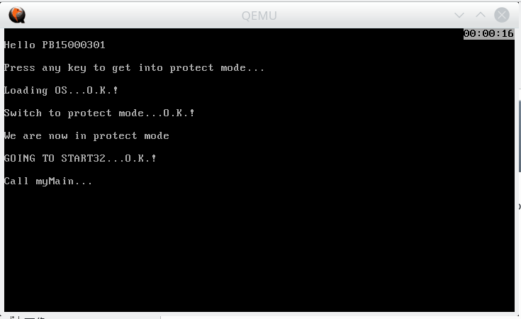
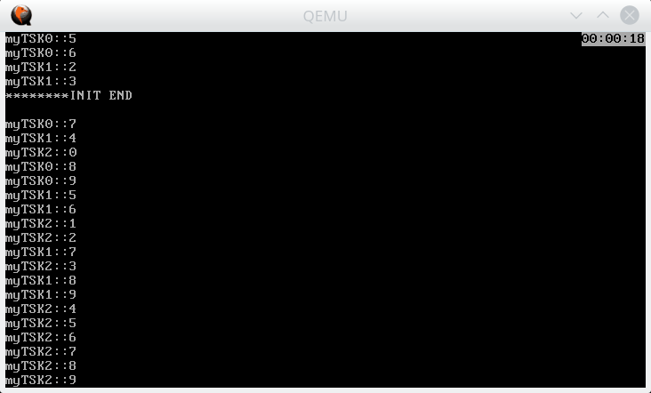
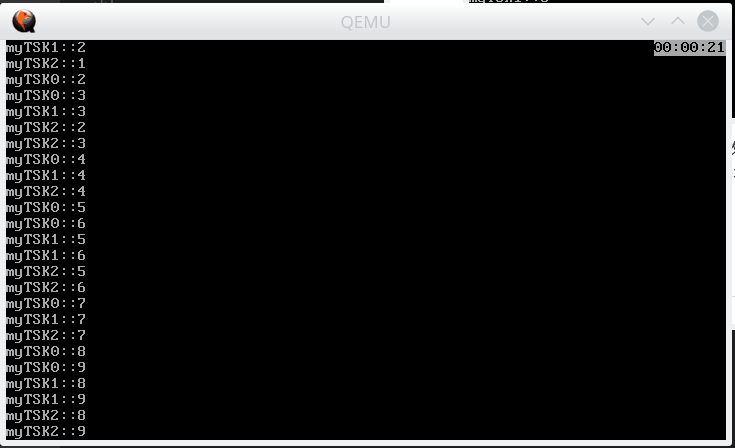

# 实验八 Round-Robin

PB15000301		宋小牛

实验内容：

- 中断初始化，提供缺省中断处理入口
- 系统时钟初始化，时钟中断
- *时间片轮转调度*

[TOC]

## 中断初始化

编写了一个在屏幕右上角输出绿色！的中断处理函数

```asm
.globl myfrstint
myfrstint:
movw    $0x0221,	%ax				#绿色！
movl    $79,    	%ebx			#右上角
movw    %ax,    	%gs:0(,%ebx,2)
intloop:
jmp intloop
iret
```

用这个中断填满IDT

```assembly
.section    ".IDT",     "ax"
.align      32
IDT:
.rept       64					#重复64次
.word       myfrstint			#中断处理函数
.word       0x8					#cs selector
.word       0x8E00				#属性
.word       0
.endr
IDTPtr:
.word       IDTPtr - IDT - 1
IDTBase:
.long       IDT
```

在`start32.s`的`.text`中`call myMain`之前加上初始化代码，并调用中断`int $0x20`

```assembly
call    init8259A					#由userApp提供
call    init8253					#由userApp提供
xorl    %eax,   %eax
movl    $IDT,   %eax
movl    $IDTPtr,    %ebx
movl    %eax,       %ds:2(,%ebx,1)	#填prt的base
lidt    %ds:0(,%ebx,1)
int		$0x20						#调用中断
```



可见中断调用成功

## 时钟中断

编写`tick()`，在时钟中断中调用它，每满1s调用一次`updatetime()`。启动时在`start32.s`中调用`clkinit()`

同时还修改了标准输入输出函数，以保证不覆盖右上角的时钟、清屏滚屏不清除时钟(这部分非重点，见附件源码)

```c++
void tick(void){
    tick_number++;
    if (tick_number%100==0){
        if (sec==59){
            sec=0;
            if(min==59){
                min=0;
                if(hour==99) hour=0;
                else hour++;
            }
            else min++;
        }
        else sec++;
        updatetime();
    }
} 
void updatetime(void){//更新右上角时间
    unsigned short *p=0xb8000+144;			//右上角，8位
    *p=0x7000 + (0xff & (hour/10)) + '0';	//白底黑字
    p++;
    *p=0x7000 + (0xff & (hour%10)) + '0';
    p++;
    *p=0x7000 + ':';
    p++;
    *p=0x7000 + (0xff & (min/10)) + '0';
    p++;
    *p=0x7000 + (0xff & (min%10)) + '0';
    p++;
    *p=0x7000 + ':';
    p++;
    *p=0x7000 + (0xff & (sec/10)) + '0';
    p++;
    *p=0x7000 + (0xff & (sec%10)) + '0';
}
void clkinit(void){
    tick_number=0;
    hour=min=sec=0;
    updatetime();
}
```

更新IDT，简单起见将所有中断改为clkhandler

```assembly
.section    ".IDT",     "ax"
.align      32
IDT:
.rept       64					#重复64次
.word       clkhandler			#中断处理函数
.word       0x8					#cs selector
.word       0x8E00				#属性
.word       0
.endr
```

```assembly
.globl clkhandler
clkhandler:
pushf
pusha
movl    %esp,   espstore
call tick
popa
popf
iret
```

将`start32.s`的`.text`中`call myMain`注释掉，在其之前加上`call clkinit`与`sti`，(以死循环结尾，前几次实验的遗留)

运行结果：右上角时间将动态更新，截图只截了其中一帧



## 时间片轮转调度

调度分为时间片满与进程结束两种情况，第一种需要将当前进程送到队列末尾并保存现场，第二种则不需要

```c++
void schedule(){
    disableRQ();
    rrtime=0;							//时间片计数，在tick()中加入rrtime++以及
  										//if (rrtime%50 == 0 ) schedule();
  										//其中50为时间片大小
  
    if(tskhead==tskrear) {              //idle left
        if(tskrear->state==0) {			//idle already runing
            enableRQ();
            return;   
        }
        prevSP=&(tskrear->stktop);
        nextSP=tskrear->stktop;         //start idle
        tskrear->state=0;
        tskcurrent=tskrear;
        CTX_SW();
    }
    else {                              //not just idle, start the first task
        if(tskcurrent->state==0){		//当前进程正在运行，中断调度
            tskcurrent->state=1;
            dequeue();
            inqueue(tskcurrent);
            prevSP=&(tskcurrent->stktop);
            nextSP=(tskhead->next)->stktop; 
            tskcurrent=tskhead->next;
            tskcurrent->state=0;
            CTX_SW_iret();				//该上下文切换将保存上文
        }
        else {
            //already dequeue
            prevSP=&(tskcurrent->stktop);	//当前进程已结束
            nextSP=(tskhead->next)->stktop; 
            tskcurrent=tskhead->next;
            tskcurrent->state=0;
            CTX_SW();						//该上下文切换不保存上文
        }
    }
}
```

由于中断时上一个进程的上下文实际上应在`clkhandler`中保存，故在其中加上保存`esp`寄存器的指令，并在`CTX_SW_iret`中恢复栈指针

```assembly
.globl clkhandler
clkhandler:
pushf
pusha
movl    %esp,   espstore		#保存esp，espstore为myOS.h中定义的变量
call 	tick
popa
popf
iret

.globl CTX_SW_iret
CTX_SW_iret:				#命名为iret是历史遗留问题
movl    prevSP,     %eax
movl    espstore,   %ecx
movl    %ecx,       (%eax)
movl    nextSP,     %esp
popa 
popf
sti
ret							#为什么不能使用iret？
							#如果下一个进程还未运行过，那么iret将错恢复efages
							#为什么不改变栈中eflags的位置？
							#gdb调试查看内存时发现有时候call会push %cs有时候不会

.global CTX_SW
CTX_SW: 
movl    nextSP,     %esp
popa 
popf
sti
ret
```

运行结果：

由于init被当作进程，是可被中断的，故会出现tsk1、tsk2还没被创建好，tsk0已经开始运行的情况。如果在init的开头加上关中断，则三个进程的行为基本一致

## 总结

由于是考完试的实验，一开始翻了很多比较智障的错误，比如栈里面的eflags初值不允许中断，Gate属性填错等。做完实验回顾一下确实没有比较难的东西，就是中断什么的初看起来看不懂，不太清楚哪些东西是需要自己实现的。